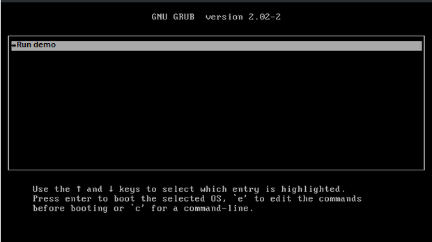

# Basic Operating system
<p>This is basic operating system, with kernel made in C.</p>
<br><br>



## Requirements:-

*   GNU/Kali Linux.
*   GNU Assembler(gas) to instruct the bootloader for loading the starting point of our kernel.
*   GCC - GNU Compiler Collection a cross compiler. A newer version of GCC (7.2.0 version of GCC)
*   If you use old version you may face multiboot header not found error.
*   Xorriso - A package that creates, loads, manipulates ISO 9660 filesystem images.(man xorriso)
*   grub-mkrescue - Make a GRUB rescue image, this package internally calls the xorriso functionality to build an iso image.
*   VMware

## Execution:-


### For linux
*   Open terminal and run following command:-
```
./run.sh
```

*   You will get the iso file, now run it in VMware


## Authors
- [@abhineetraj1](https://www.github.com/abhineetraj1)
